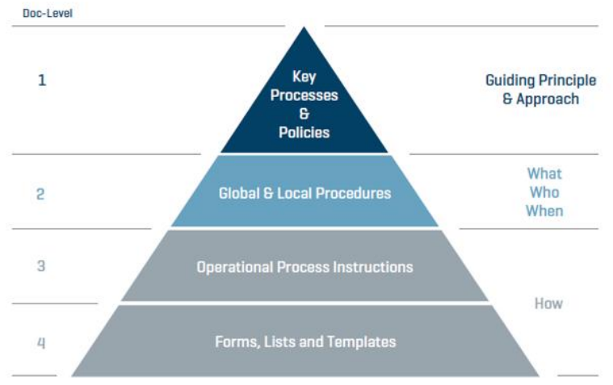
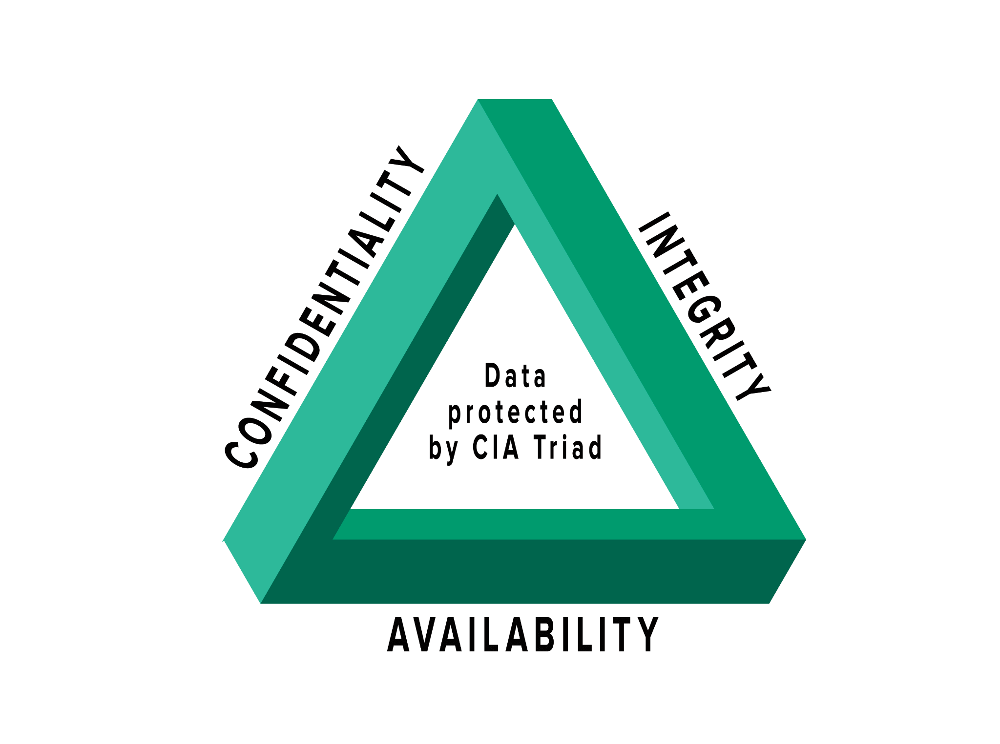
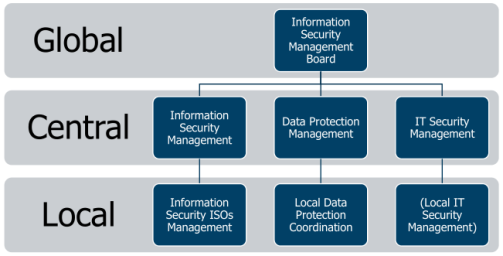
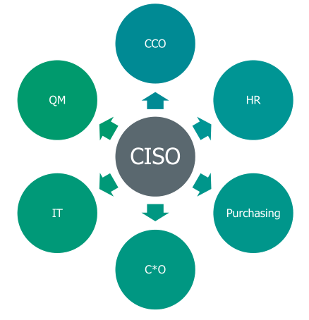

# 1 ISO Voraussetzungen, Policies, Organisation, Governance Model

Ist ISO eine IT Rolle?
> der ISO sollte innerhalb der IT-Abteilung positioniert sein. So ist eine effektive Zusammenarbeit mit der IT-Abteilung möglich

Was ist die Verbindung zwischen ISO und der Gesetzgebung?
> Der ISO hat die Aufgabe, rechtliche Rahmenbedingungen der Datenverarbeitung zu kontrollieren.

## Klassifizierung von Sicherheitsrisiken 

1. Niedrig: wenige Angriffe, keine Indikatoren für Eindringlinge oder Attacken
2. Gesichert: normales Risiko. Keine Indikatoren für Eindringlinge oder Attacken
3. Erhöht: Signifikantes Risiko: Mäßige Anzahl an Angriffen. Keine Anzeichen für Eindringlinge oder direkte Attacken
4. Hoch: Hohes Risiko: hohe Anzahl an gemeldeten Angriffen. Keine Anzeichen für Eindringlinge oder direkte Attacken
5. Schwer: schweres Risiko. Anzeichen oder starker Verdacht für Eindringlinge

## Schwächen

### ISMS 
1. Fehlende oder unklare Anforderungen an InfoSec
2. Unklares InfoSec Vorgehensmodel
3. Fehlende Produkt- oder Service Lifecycle Orientierung :arrow_right: veraltete produkte und Services
4. Fokus nur auf technische Umsetzung :arrow_right: Prozesse hinter Technologien benötigt
5. Fehlende Standardisierung :arrow_right: führt zu unsicheren Architekturen, Lösungen und Software
6. Fehlende Notfall Planung :arrow_right: nicht zu bewältigendes Risiko

### Cyber Security
1. Schwachstellen in Software :arrow_right: nicht angemessen sicher genug für Gefahrenlage
2. Unangemessener Schutz gegen Malware :arrow_right: geringe Erkennungsrate
3. Identifikation und Authentifizierung fehlend :arrow_right: Passwörter alleine sind nicht sicher genug
4. Unsichere Webseiten
5. Mobilgeräte Nutzung :arrow_right: Generierung zusätzlicher Angriffsvektoren (immer an, fehlende Updates, Nutzung unsicherer Netze)
6. E-Mail ist wie Postkarte :arrow_right: Phishing, Werbung, Viren, Social Engineering
7. Bezahlen mit persönlichen Daten :arrow_right: hohes Risiko für Privatsphäre
8. Fehlende Internet Kompetenz
9. Manipulierte Technologien
10. Fake News

## Operational Excellence (OPEX)
- Mindset der gewisse Prinzipien und Tools umfasst, um eine *Culture of Excellence* im Unternehmen einzuführen.
- Jeder Mitarbeiter kann den Wertefluss zum Kunden einsehen, dazu beitragen und ihn verbessern

Zielsetzung:

:arrow_right: Kernprozesse in der Wertschöpfungskette ständig im Hinblick auf Effektivität und Effizienz optimieren. Unterstützt durch die richtige Kombination der Verbesserungsmethoden den kontinuierlichen Verbesserungsprozess.

## COBIT (Control Objectives for Information and Related Technology)

International anerkanntes Framework zur IT-Governance und gliedert IT Aufgaben in Prozesse und Kontrollziele.

:arrow_right: Es wird definiert was umzusetzen ist, nicht wie es umzusetzen ist.

## ISMS / Policies

Schritte zur Einführung von ISO 27001:
1. Management Überzeugen
2. Verstehen wer in welcher Form betroffen ist. Prozesse und Dokumentationen benötigt
3. Vorbereitung von z.B. Risiko Analysen, Notfallplänen, Trainings
4. Implementierung des ISMS inklusive Prozesse und Handhabung von Risiken
5. Überwachen und Überprüfen der Prozesse, Aktivitäten. Stage 1 Audit, Management Review und kontinuierliche Verbesserung/Anpassung
6. Zertifizierung. Stage 2 Audit, Management Überprüfung, kontinuierliche Verbesserung

### Einführung eines ISMS

```mermaid
flowchart LR
    id1[Anforderungen \n und \n Standards \n definieren]--> id2[Beteiligte \n ermitteln]--> id3[ISMS Scope \n festlegen] --> id4[GAP Analyse \n durchführen]--> id5[Kosten \n und \n Aufwand \n Schätzung]--> id6[Management \n Erlaubnis \n erhalten] --> id7[Projekt Start]
```

## Standards

| Standard | Icon | Beschreibung |
| --- | --- | --- | 
| ISO 27001 |  | Internationale Norm für Einrichtung, Umsetzung, Aufrechterhaltung und fortlaufende Verbesserung eines dokumentierten Informationssicherheits-Managementsystems |
| TISAX |  | TISAX ist Kfz-Branchen-spezifisch. Der Standard betrifft die sichere Verarbeitung von Informationen von Geschäftspartnern, den Schutz von Prototypen und den Datenschutz gemäß Datenschutz-Grundverordnung (DSGVO) für mögliche Geschäfte zwischen Autoherstellern und ihren Dienstleistern oder Lieferanten |
| BSI Standard 200 |  | Erläutert den Aufbau eines Informationssicherheitsmanagementsystems (ISMS). Kompatibel zum ISO -Standard 27001 und berücksichtigt die Empfehlungen der anderen ISO -Standards wie ISO 27002 |
| KRITIS |  | Standard gültig für Betreiber kritischer Infrastrukturen. Umfasst 9 Sektoren der Kritischen Infrastruktur welche wichtige Bedeutung für das staatliche Gemeinwesen haben und  deren Ausfall oder Beeinträchtigung nachhaltig wirkende Versorgungsengpässe, erhebliche Störungen der öffentlichen Sicherheit oder andere dramatische Folgen haben würde. |
| IT Sicherheitsgesetz |  | Verbesserung der Sicherheit informationstechnischer Systeme (IT-Sicherheit) in Deutschland und Schutz kritischer Infrastrukturen, welche für das Funktionieren des Gemeinwesens relevant sind | 

## ISMS Scope festlegen

- Geographischer Scope
- Produktionsstandorte
- Organisationen
- Rollen
- Verfahren
- Prozesse

## GAP Analyse

Zeigt folgende Aspekte:

- Status der implementierten Maßnahmen
- Verbesserungsbedarf
- Fehlende Implementierungen

Soll folgende Aspekte liefern:

- Aktueller Status
- benötigte Maßnahmen
- Benötigte Mittel: Zeit + Geld

## Informations Sicherheits Policies (ISO 27001, 5.2, A.5) :hammer:

### 5.2 Policy

Das Management soll eine Informationssicherheitsrichtlinie einführen, die:

<ol type="a">
  <li>dem Zweck der organisation angemessen ist</li>
  <li>IT Sec. Ziele beinhaltet oder ein Framework hierfür bereitstellt</li>
  <li>Verpflichtungen zur Einhaltung der geforderten Ziele beinhaltet</li>
  <li>Verpflichtungen zur kontinuierlichen Verbesserung des ISMS beinhaltet</li>
</ol>

Die Richtlinie sollte:
<ol type="a" start="5">
  <li>als Dokumentation vorhanden sein</li>
  <li>mit der Organisation kommuniziert sein</li>
  <li>interessierten Betroffenen zugänglich gemacht werden</li>
</ol>

## Informations Sicherheits Policies (BSI 200-1, 7.1) :hammer:

Formulierung sicherheitsrelevanter Ziele und einer Sicherheitsrichtlinie.

Die IT Sicherheitsziele sollten bei jedem Sicherheitsprozess festgelegt werden.

Folgende Aspekte sollten bei der Entwicklung der Sicherehits Strategie berücksichtigt werden:

- Ziele der Unternehmung oder Rolle der Behörde
- Rechtliche Anforderungen und Regularien wie z.B. Datenschutz
- Kunden Anforderungen und existierende Verträge
- Interne Rahmenbedingungen
- IT gestützte Business Prozesse und Aufgaben
- Globale Bedrohungen und Gefahren durch Sicherheitsrisiken

## ISMS schematischer Aufbau

- Level 1-3 definieren Anforderungen
  - Policies
  - Prozeduren
  - Arbeitsanweisungen
- Level 4 enthält verschriftlichte Dokumente
  - Meeting Minutes
  - Dokumentationen (Trainings Nachweise)
  - Pentest Reports
  - Log Dateien

## Zielsetzung, ISO27001, 6.2 :hammer:

Die Organisation sollte IT Recht für ISOs Zielsetzungen an relevanter Funktion und Position einbringen.

Zielsetzungen sollen:

<ol type="a">
  <li>Konsistente zu Richtlinien sein</li>
  <li>Messbar sein</li>
  <li>Berücksichtigung der Anforderungen des geltenden IT-Rechts für ISOs und
die Ergebnisse der Risikobewertung und Risikobehandlung</li>
<li>Kommuniziert werden</li>
<li>Bei Bedarf angepasst werden</li>
</ol>

Grundsatz :arrow_right: Bei Bedarf sollten die High-Level Ziele zu spezifischeren Zielsetzungen heruntergebrochen werden.

---

## CIA Triade

Wichtigste IT Schutzziele:

- Vertraulichkeit: Daten sollten vertaulich verarbeitet werden und nur von autorisierten Nutzern eingesehen werden können. :arrow_right: Kompromitierungsbeispiel: Laptop geklaut, Passwort Diebstahl
- Integrität: Daten sollen korrekt und vollständig sein. Änderungen müssen nachvollzogen werden können. :arrow_right:  Kompromitierungsbeispiel: Ransomware → Die Daten werden verändert
- Verfügbarkeit: Informationstechnische Systeme müssen durchgängige Verfügbarkeit der Daten gewährleisten. Festlegung des Rahmens durch Unternehmen in Service-Level-Agreement :arrow_right: DDoS Angriff

## Informationssicherheit Schutzziele

1. Informationen sind verfügbar, wenn sie benötigt werden
2. Vertrauliche Informationen müssen angemessen behandelt werden
3. Datenabfluss muss verhindert werden
4. Investitionen in IT, Operation und Know-How muss geschützt werden
5. Kosten bei eventuellem Schaden muss klein gehalten werden
6. Das Recht auf informationelle Selbstbestimmung muss gegeben sein
7. Einhaltung lokaler Richtlinien und Gesetze

## Informationssicherheits Prinzipien

1. CIA
2. InfoSec Franework nach ISO 27001 ausgerichtet
3. Anpassung und Skalierung nach Bedarf
4. Klar definierte Verantwortlichkeiten
5. Vorhandensein des Bewussteins für InfoSec
6. Globale Sicherheits Richtlinien müssen umgesetzt werden
7. Vorfälle müssen sofort gemeldet werden
8. Regelmäßige Audits notwendig
9. Management muss Unterstützung zeigen und motivieren, Verbesserungsvorschläge einzureichen

## Organisation von Informationssicherheit (ISO 27001, 5.3) :hammer:

### 5.3

Führungsebene muss sicherstellen, dass Verantwortlichkeiten und Pflichten zugewiesen und kommuniziert sind.

Soll Verantwortlichkeiten zuweisen für:

<ol type="a">
  <li>Sicherstellung, dass InfoSec Anforderungen dieses internationalen Standards entspricht</li>
  <li>Berichterstattung über Performance der InfoSec an Führungsebene</li>
</ol>

## Organisation von Informationssicherheit (BSI 200, 7.2) :hammer:

### 7.2

Festlegen und Planung von  orga. Strukturen, Rollen und Pflichten.

Bei der Planung der Rollen, müssen folgende Regeln beachtet werden:

1. Die Verantwortung für InfoSec verbleibt in der Führungsebene
2. Es muss eine koordinierende Person geben (ISO)
3. Jeder Mitarbeiter ist für die Informationssicherheit an der eigenen Arbeitsstelle verantwortlich (beachten der Do's and Dont's in Bezug auf InfoSec)

## Organisation von Informationssicherheit

```mermaid
flowchart LR
    id1[1: Analysieren und Sammeln]--> id2[2: Struktur und Umwandlung]--> id3[3: Implementierung ]
```
1. 
   1. Was ist benötigt
   2. In welchem Kontext?
   3. In welcher Form?
2. 
   1. Ähnlichkeiten von Anforderungen
   2. Widersprüchlichkeiten von Anforderungen
   3. Wie passen Anforderungen in Struktur
3. 
   1. Einen Demand starten und abarbeiten
   2. Management Erlaubnis einholen
   3. Strukturen schaffen, Prozesse, Tools, Verwaltung
   4. Informieren und Trainieren von Mitarbeitern

## Information Security Management Board (ISMB)

## Chief Information Security Officer (CISO)

CISO interagiert mit allen relevanten Teilbereichen.

## ITIL

### ITIL v3

Ist die 3. Version der ITIL Service Operation und betrifft alle Aktivitäten und Maßnahmen zur Bereitstellung und Instandhaltung der IT-Infrastruktur, entsprechend ihrem Bestimmungszweck.

#### Prozesse:

- Request Fulfilment
  - Abbildung standardisierter Prozesse :arrow_right: Anlaufstelle für Anfragen, Beschwerden, ...
- Event Management
  - Event ist Ereignis, das in IT ausgelöst wurde. Event muss zur Lösung an Servicedesk weitergeleitet werden
- Incident Management
  - Störungen werden nach vereinbarten Service Levels bearbeitet
- Problem Management 
  - Hier werden dem Incident-Management temporäre Lösungen (workarounds) zur Verfügung gestellt
  - Befasst es sich mit der Störungsvermeidung (proaktives Management)

### ITIL v4

ITIL 4 bringt einige neue Gedanken ein und entwickelt bestehende Inhalte von ITIL v3 weiter. 

- ITIL 4 nennt zwei Schlüsselelemente:
- Service Value System SVS 7
- Modell der vier Dimensionen

Ganzeinheitlicher Ansatz für Management
- Organisation und Personen
- Informationen und Technologien
- Partner und Lieferanten
- Wertströme und Prozesse

### Vergleich ITIL 4 im Vergleich zu ITIL 3

- Continual Improvement: beide
- Identity und Access Management: beide
- Definition von Maßnahmen und Berichterstattungen: nur in ITIL 4

## ISO20000

- Internationaler Standard für IT Service Management
- Ursprünglich entwickelt, um Best-Practice Guidelines innerhalb ITIL aufzuzeigen

| Standard | Zertifizierung Unternehmen möglich | Zertifizierung Person möglich | Gültigkeit |
| --- | --- | --- | --- |  
| ISO/IEC 20000 | Ja | Nein | 3 Jahre |

---

[Chapter 2](chapter_2.md)